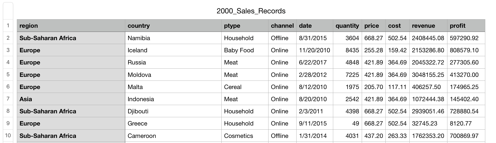

## Description

<p>This repo can be used as a reference when building advanced API filters with DRF and Postgresql.</p>
<p>The app is dockerized for easy installation. You need to run just a few commands to set it up. This is also a good example on how to configure Docker-Compose for a django app with postgresql database.</p>
<p>I've used an open dataset for 2000 Sales records of 12 product types. The original dataset consists of 50000 records, so please let me know if you want to test out with a bigger database.</p>

<p align=center>First 10 records from the dataset</p>


## System Requirements

- Docker
- Docker Compose

## Build instructions with Docker Compose

1. Clone the repo

```shell
git clone https://github.com/talented/Sales-Records-API.git
```

2. Run

```shell
docker-compose up --build
```

3. Without stopping the running server open a new tab in your terminal and run commands below to populate the postgresql database in your running container with the data from "2000_Sales_Records.csv" under pgdata folder

```shell
docker cp init.sql apitest_db_1:/docker-entrypoint-initdb.d/init.sql

docker exec -u postgres apitest_db_1 psql postgres postgres -f docker-entrypoint-initdb.d/init.sql
```

4. Check your browser that your API endpoint is ready at

```shell
localhost:8000/api/sales
```

## API filters

<p>GET {website}/api/sales display a DRF List API view. Avaliable filter types are listed below:<p>

### Filter by Field name

- for filtering by field names like `country=Germany`, `region=Europe` or same values for sale price like `price=500`

### Filter by date

- for exact date filtering like `date=01.06.2017`
- `date_to` - # filter by date as "is_less_than_or_equal_to" in format "%d.%m.%Y"
- `date_from` - # filter by date as "is_greater_than_or_equal_to" in format "%d.%m.%Y"

### Filter by 'LESS THAN OR EQUAL TO' & 'GREATER THAN OR EQUAL TO'

- Defining minimum and maximum value filters in a row for numeric fields ('quantity', 'price', 'cost', 'revenue', 'profit', 'profit_percentage') to be used in filtering as "is_less_than_or_equal_to" and "is_greater_than_or_equal_to"
- Usage is as `min_revenue=10000` or `max_price`

### Ordering Filter

- `ordering` - to order queryset in ascending or descending as `ordering=quantity` ASC or `ordering=-quantity` DESC

### Grouping Filter

- `groupby` - to group by one or more columns: date, region, country, ptype, channel (not numeric columns) with a result of total values of quantity, price, cost, revenue, profit and calculated profit_percentage of total revenue and total profit

### Search Filter

- `search` - to make a case insensitive search in values for all items in a queryset
- Usage is as `search=Meat` or even `search=Me`. First search will return items with ptype=Meat, second one will also return items like region=North America

## USE-CASE TESTS

1. Show the number of quantity and total cost of sales before 1st of June 2015, broken down by channel and country, sorted by profit_percentage in descending order.

```shell
GET {website}/api/sales?groupby=country&groupby=channel&date_to=01.06.2015&ordering=-profit_percentage
```

2. Show the total cost of products in May of 2017 on ptype, broken down by date, sorted by date in ascending order.

```shell
GET {website}/api/sales?groupby=ptype&groupby=date&date_from=01.03.2010&date_to=31.03.2010&ordering=date
```

3. Show revenue, earned in 2015 in Europe region, broken down by country and sorted by revenue in descending order.

```shell
GET {website}/api/sales?region=Europe&groupby=country&date_from=01.01.2015&date_to=31.12.2015&ordering=-revenue
```

4. Show profit percentage for Turkey broken down by channel ordered by profit percentage in descending order.

```shell
GET {website}/api/sales?country=Turkey&groupby=channel&ordering=-profit_percentage
```

## TO DO

- [x] Dockerize the app
- [ ] Deploy to AWS
- [ ] Build a React or Vue Frontend to dynamically filter Sales data
- [ ] Visualize filtered results with charts (D3.js can be used)
